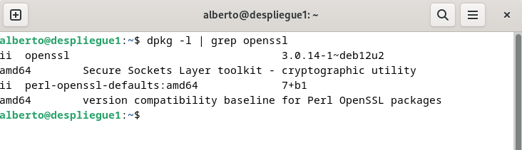
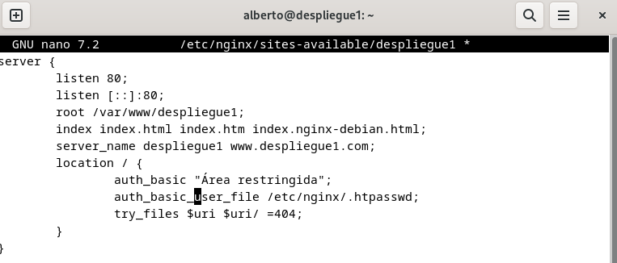
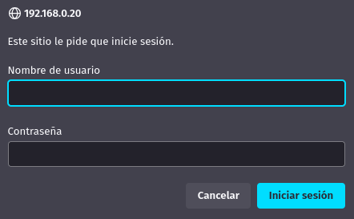
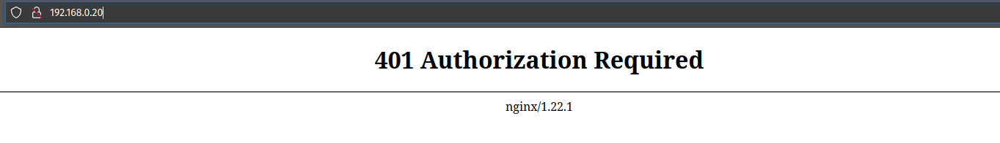
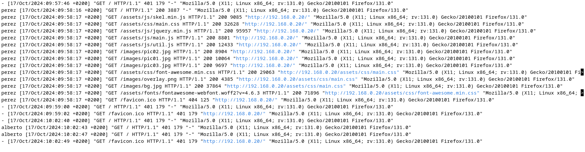
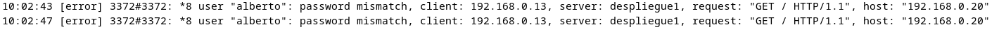
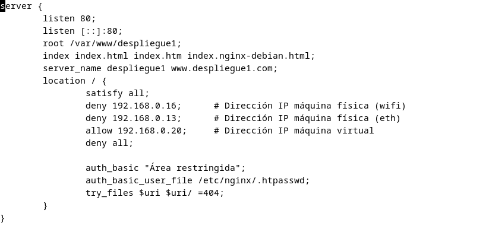
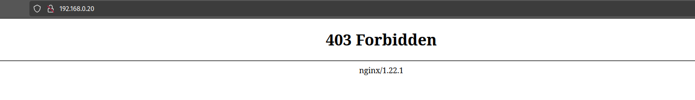
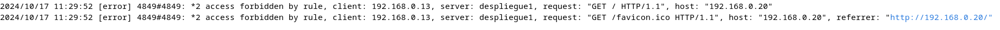

# Práctica 2.2 

## Creación de usuarios y contraseñas para el acceso

Verificamos que tenemos openssl en la máquina:



Creamos un archivo para guardar usuarios y contraseñas llamado ".htpasswd" ejecutando:

```console
sudo sh -c "echo -n 'alberto:' >> /etc/nginx/.htpasswd"
```

y también crearemos una contraseña cifrada ejecutando:

```console
sudo sh -c "openssl passwd -apr1 >> /etc/nginx/.htpasswd
```

Voy a crear dos usuarios distintos y a leer el fichero para comprobar que el contenido es correcto:


## Configuración para autenticación básica

Para configurar la autentificación de nuestro servidor, modificaremos el archivo 
/etc/nginx/sites-available/despliegue1 y añadiremos dos nuevas líneas dentro del 
apartado "location":



Reiniciamos el servicio y comprobamos que no hay ningún error con:
```console
sudo systemctl restart nginx
sudo nginx -t
```

Ahora, si tratamos de entrar a la página desde el navegador, aparecerá el 
siguiente mensaje:



Si nos autentificamos correctamente, entraremos a la página sin problema.

En caso de que no indiquemos uno de los usuarios y contraseña que hemos creado 
anteriormente, no se nos permitirá el acceso a la página:



Podemos comprobar los registros de peticiones de entrada a la página en 
/var/log/nginx/access.log y /var/log/nginx/error.log (peticiones denegadas o 
erróneas):






## Restricción de acceso por IP

A continuación, vamos a configurar una restricción de acceso para que sólo tengan 
acceso las IPs que indiquemos.

Para ello, volvemos a editar el archivo /etc/nginx/sites-available/despliegue1:



Desglosando las líneas añadidas:

- La configuración "satisfy all" obliga a que cada dirección IP deba cumplir tanto 
la autentificación que configuramos anteriormente como que la solicitud provenga de 
una IP válida. Si en su lugar indicásemos "satisfy any", valdría con que sólo se 
cumpliera una de las dos condiciones.

- Las líneas "deny 192.168.X.X" restringen el acceso de esas direcciones de manera 
específica. Como está activado "satisfy all", no se podrá acceder ni aunque se conozca 
un usuario y contraseña válidos. En este caso, he prohibido las direcciones IP que en 
mi red local se refieren a mi máquina física.

- La línea "allow 192.168.X.X" permite el acceso de una IP en específico, 
aunque será necesario autentificarse para acceder a la página. En este caso, he permitido 
el acceso de la máquina virtual en la que se aloja el servidor.

- La línea "deny all" indica que el resto de direcciones desde las que se solicite 
acceso tienen entrada prohibida a la página. Debe colocarse al final para que sea 
evaluada en último lugar y no prohíba el acceso de IPs que sí queremos que tengan acceso.


Tras guardar los cambios con la nueva configuración, compruebo desde mi máquina física 
que al intentar entrar a la página, se me prohíbe el acceso:



Y también se puede comprobar que efectivamente se ha prohibido el acceso a esta IP 
desde el archivo /var/log/nginx/error.log:



## Cuestiones finales

### Cuestión 1

**Supongamos que yo soy el cliente con la IP 172.1.10.15 e intento acceder al directorio "web_muy_guay" de mi sitio web, equivocándome al poner el usuario y contraseña. ¿Podré acceder?¿Por qué?**

```nginx
    location /web_muy_guay {
    #...
    satisfy all;    
    deny  172.1.10.6;
    allow 172.1.10.15;
    allow 172.1.3.14;
    deny  all;
    auth_basic "Cuestión final 1";
    auth_basic_user_file conf/htpasswd;
}
```

Por la directiva "satisfy all", el usuario tendrá que cumplir con todas las reglas de acceso; 
por una parte, lo tiene permitido por la directiva "allow 172.1.10.15", pero también está 
obligado a autenticarse según los credenciales almacenados en "conf/htpasswd".

### Cuestión 2

**Supongamos que yo soy el cliente con la IP 172.1.10.15 e intento acceder al directorio web_muy_guay de mi sitio web, introduciendo correctamente usuari y contraseña. ¿Podré acceder?¿Por qué?**

```nginx
    location /web_muy_guay {
    #...
    satisfy all;    
    deny  all;
    deny  172.1.10.6;
    allow 172.1.10.15;
    allow 172.1.3.14;

    auth_basic "Cuestión final 2: The revenge";
    auth_basic_user_file conf/htpasswd;
}
```

En este caso, el usuario tampoco podrá acceder, ya que como la directiva "deny all" se 
evalúa antes que "allow 172.1.10.15" y que la directiva de autenticación, el servidor 
le denegará el acceso.

### Cuestión 3

**Supongamos que yo soy el cliente con la IP 172.1.10.15 e intento acceder al directorio web_muy_guay de mi sitio web, introduciendo correctamente usuario y contraseña. ¿Podré acceder?¿Por qué?**

```nginx
    location /web_muy_guay {
    #...
    satisfy any;    
    deny  172.1.10.6;
    deny 172.1.10.15;
    allow 172.1.3.14;

    auth_basic "Cuestión final 3: The final combat";
    auth_basic_user_file conf/htpasswd;
}
```

Tampoco le será posible al usuario acceder, ya que se le está denegando el acceso 
explícitamente a su IP con la directiva "deny 172.1.10.15".

### Cuestión 4

**Supongamos que quiero restringir el acceso al directorio de proyectos porque es muy secreto, eso quiere decir añadir autenticación básica a la URL:Proyectos. Completa la configuración para conseguirlo:**

```nginx
    server {
        listen 80;
        listen [::]:80;
        root /var/www/freewebsitetemplates.com/preview/space-science;
        index index.html index.htm index.nginx-debian.html;
        server_name freewebsitetemplates.com www.freewebsitetemplates.com;
        location   {

            try_files $uri $uri/ =404;
        }
        location   /proyectos   {
            auth_basic "Cuestión final 3: The final combat";
            auth_basic_user_file conf/htpasswd;
            try_files $uri $uri/ =404;
        }
    }
```
